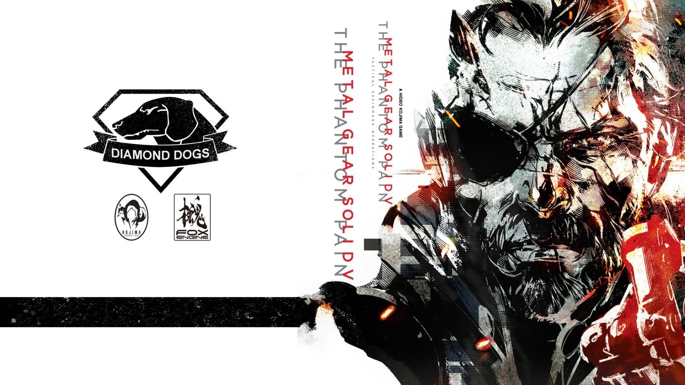

# Metal Gear Solid V - Phantom UI

MGSV TPP inspired BetterDiscord/Vesktop theme.

## Features

- Tactical transparent UI
- MGSV aesthetic
- Animated scanlines
- Red laser overlays
- Green military HUD glow
- Glassmorphism panels
- Wallpaper support
- Optimized for Vesktop

## Wallpaper



## Installation

1. Install BetterDiscord or Vesktop
2. Download `Metal Gear Solid.theme.css`
3. Put it in your themes folder
4. Enable the theme

## Vesktop Flatpak

Launch with transparency:

```bash
flatpak run dev.vencord.Vesktop --enable-transparent-visuals --disable-gpu
```

## Wallpaper

https://wallpapercave.com/wp/wp6767571.jpg
